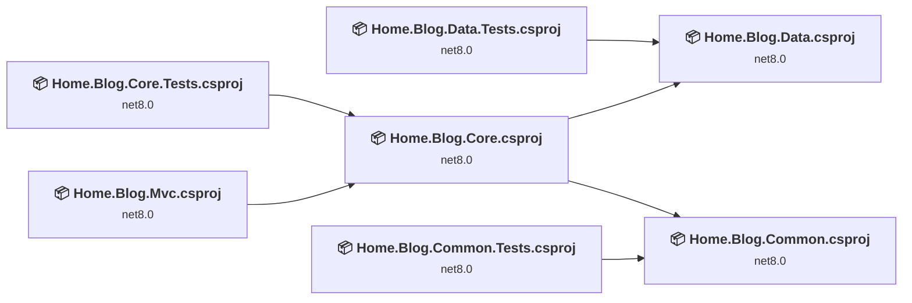
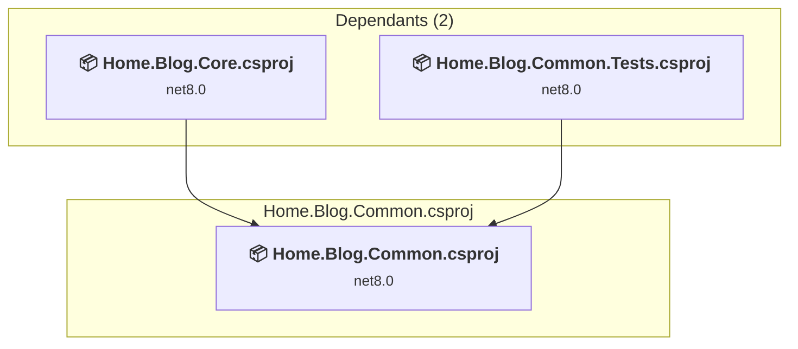
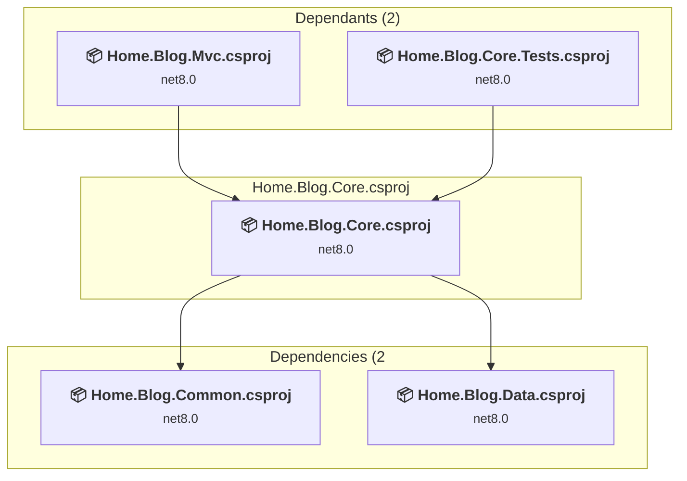
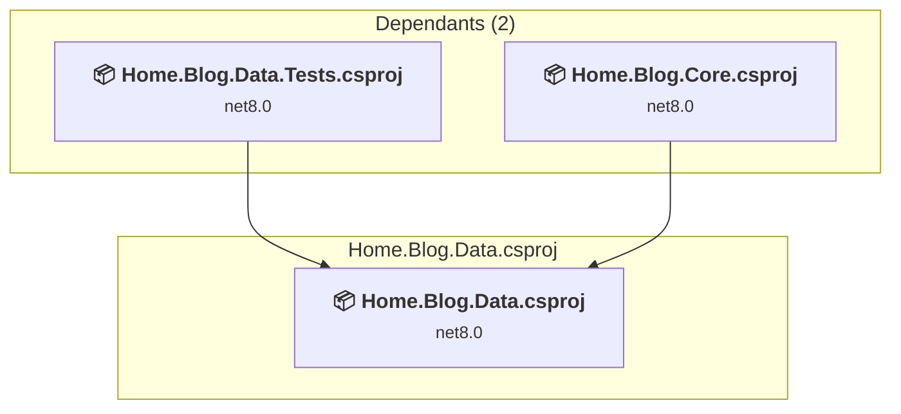
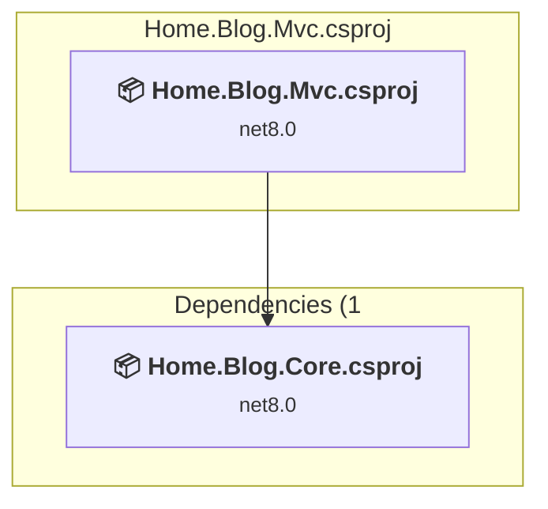
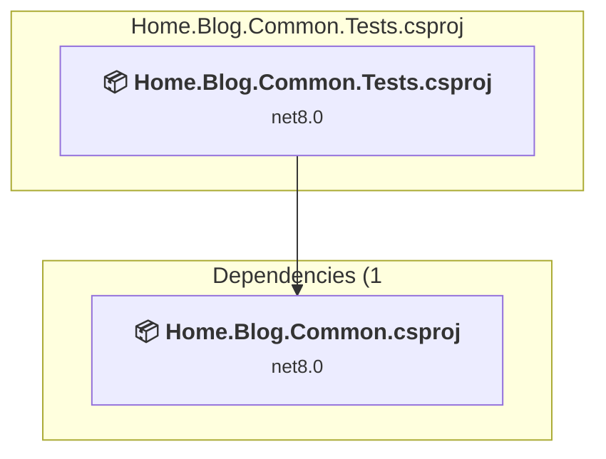
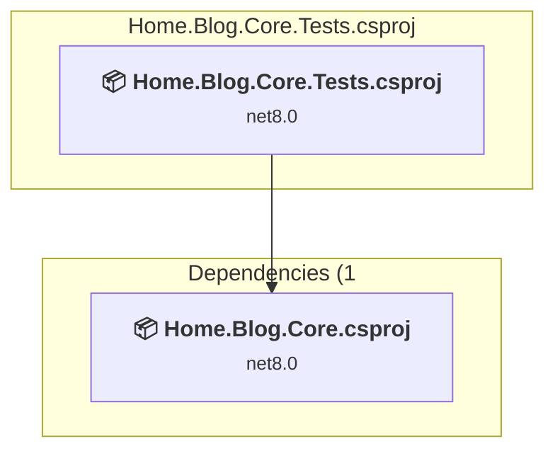
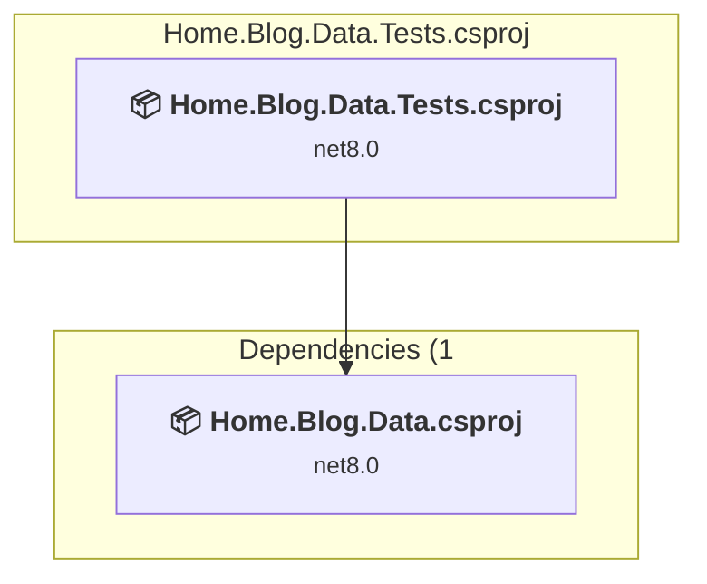

# Projects and dependencies analysis

This document provides a comprehensive overview of the projects and their dependencies in the context of upgrading to .NETCoreApp,Version=v10.0.

## Table of Contents

- [Executive Summary](#executive-Summary)
  - [Highlevel Metrics](#highlevel-metrics)
  - [Projects Compatibility](#projects-compatibility)
  - [Package Compatibility](#package-compatibility)
  - [API Compatibility](#api-compatibility)
  - [Binding Redirect Configuration](#binding-redirect-configuration)
- [Aggregate NuGet packages details](#aggregate-nuget-packages-details)
- [Top API Migration Challenges](#top-api-migration-challenges)
  - [Technologies and Features](#technologies-and-features)
  - [Most Frequent API Issues](#most-frequent-api-issues)
- [Projects Relationship Graph](#projects-relationship-graph)
- [Project Details](#project-details)

  - [src\Home.Blog.Common\Home.Blog.Common.csproj](#srchomeblogcommonhomeblogcommoncsproj)
  - [src\Home.Blog.Core\Home.Blog.Core.csproj](#srchomeblogcorehomeblogcorecsproj)
  - [src\Home.Blog.Data\Home.Blog.Data.csproj](#srchomeblogdatahomeblogdatacsproj)
  - [src\Home.Blog.Mvc\Home.Blog.Mvc.csproj](#srchomeblogmvchomeblogmvccsproj)
  - [tests\Home.Blog.Common.Tests\Home.Blog.Common.Tests.csproj](#testshomeblogcommontestshomeblogcommontestscsproj)
  - [tests\Home.Blog.Core.Tests\Home.Blog.Core.Tests.csproj](#testshomeblogcoretestshomeblogcoretestscsproj)
  - [tests\Home.Blog.Data.Tests\Home.Blog.Data.Tests.csproj](#testshomeblogdatatestshomeblogdatatestscsproj)

## Executive Summary

### Highlevel Metrics

| Metric | Count | Status |
| :--- | :---: | :--- |
| Total Projects | 7 | All require upgrade |
| Total NuGet Packages | 201 | 9 need upgrade |
| Total Code Files | 37 |  |
| Total Code Files with Incidents | 8 |  |
| Total Lines of Code | 1950 |  |
| Total Number of Issues | 20 |  |
| Estimated LOC to modify | 3+ | at least 0.2% of codebase |

### Projects Compatibility

| Project | Target Framework | Difficulty | Package Issues | API Issues | Binding Issues | Est. LOC Impact | Description |
| :--- | :---: | :---: | :---: | :---: | :---: | :---: | :--- |
| [src\Home.Blog.Common\Home.Blog.Common.csproj](#srchomeblogcommonhomeblogcommoncsproj) | net8.0 | 🟢 Low | 1 | 3 | 0 | 3+ | ClassLibrary, Sdk Style = True |
| [src\Home.Blog.Core\Home.Blog.Core.csproj](#srchomeblogcorehomeblogcorecsproj) | net8.0 | 🟢 Low | 0 | 0 | 0 |  | ClassLibrary, Sdk Style = True |
| [src\Home.Blog.Data\Home.Blog.Data.csproj](#srchomeblogdatahomeblogdatacsproj) | net8.0 | 🟢 Low | 0 | 0 | 0 |  | ClassLibrary, Sdk Style = True |
| [src\Home.Blog.Mvc\Home.Blog.Mvc.csproj](#srchomeblogmvchomeblogmvccsproj) | net8.0 | 🟢 Low | 6 | 0 | 0 |  | AspNetCore, Sdk Style = True |
| [tests\Home.Blog.Common.Tests\Home.Blog.Common.Tests.csproj](#testshomeblogcommontestshomeblogcommontestscsproj) | net8.0 | 🟢 Low | 1 | 0 | 0 |  | DotNetCoreApp, Sdk Style = True |
| [tests\Home.Blog.Core.Tests\Home.Blog.Core.Tests.csproj](#testshomeblogcoretestshomeblogcoretestscsproj) | net8.0 | 🟢 Low | 1 | 0 | 0 |  | DotNetCoreApp, Sdk Style = True |
| [tests\Home.Blog.Data.Tests\Home.Blog.Data.Tests.csproj](#testshomeblogdatatestshomeblogdatatestscsproj) | net8.0 | 🟢 Low | 1 | 0 | 0 |  | DotNetCoreApp, Sdk Style = True |

### Package Compatibility

| Status | Count | Percentage |
| :--- | :---: | :---: |
| ✅ Compatible | 192 | 95.5% |
| ⚠️ Incompatible | 5 | 2.5% |
| 🔄 Upgrade Recommended | 4 | 2.0% |
| ***Total NuGet Packages*** | ***201*** | ***100%*** |

### API Compatibility

| Category | Count | Impact |
| :--- | :---: | :--- |
| 🔴 Binary Incompatible | 0 | High - Require code changes |
| 🟡 Source Incompatible | 0 | Medium - Needs re-compilation and potential conflicting API error fixing |
| 🔵 Behavioral change | 3 | Low - Behavioral changes that may require testing at runtime |
| ✅ Compatible | 4060 |  |
| ***Total APIs Analyzed*** | ***4063*** |  |

## Aggregate NuGet packages details

| Package | Current Version | Suggested Version | Projects | Description |
| :--- | :---: | :---: | :--- | :--- |
| AutoMapper | 15.1.3 |  | [Home.Blog.Mvc.csproj](#srchomeblogmvchomeblogmvccsproj) | ✅Compatible |
| Azure.Core | 1.38.0 |  | [Home.Blog.Mvc.csproj](#srchomeblogmvchomeblogmvccsproj) | ✅Compatible |
| Azure.Identity | 1.11.4 |  | [Home.Blog.Mvc.csproj](#srchomeblogmvchomeblogmvccsproj) | ⚠️NuGet package is deprecated |
| CommunityToolkit.HighPerformance | 8.4.0 |  | [Home.Blog.Core.csproj](#srchomeblogcorehomeblogcorecsproj) [Home.Blog.Core.Tests.csproj](#testshomeblogcoretestshomeblogcoretestscsproj) [Home.Blog.Data.csproj](#srchomeblogdatahomeblogdatacsproj) [Home.Blog.Data.Tests.csproj](#testshomeblogdatatestshomeblogdatatestscsproj) [Home.Blog.Mvc.csproj](#srchomeblogmvchomeblogmvccsproj) | ✅Compatible |
| coverlet.collector | 6.0.0 |  | [Home.Blog.Common.Tests.csproj](#testshomeblogcommontestshomeblogcommontestscsproj) [Home.Blog.Core.Tests.csproj](#testshomeblogcoretestshomeblogcoretestscsproj) | ✅Compatible |
| coverlet.collector | 6.0.4 |  | [Home.Blog.Data.Tests.csproj](#testshomeblogdatatestshomeblogdatatestscsproj) | ✅Compatible |
| Markdig | 0.40.0 |  | [Home.Blog.Core.csproj](#srchomeblogcorehomeblogcorecsproj) [Home.Blog.Core.Tests.csproj](#testshomeblogcoretestshomeblogcoretestscsproj) [Home.Blog.Data.csproj](#srchomeblogdatahomeblogdatacsproj) [Home.Blog.Data.Tests.csproj](#testshomeblogdatatestshomeblogdatatestscsproj) [Home.Blog.Mvc.csproj](#srchomeblogmvchomeblogmvccsproj) | ✅Compatible |
| Microsoft.AspNetCore.Cryptography.Internal | 8.0.0 |  | [Home.Blog.Mvc.csproj](#srchomeblogmvchomeblogmvccsproj) | ✅Compatible |
| Microsoft.AspNetCore.Cryptography.KeyDerivation | 8.0.0 |  | [Home.Blog.Mvc.csproj](#srchomeblogmvchomeblogmvccsproj) | ✅Compatible |
| Microsoft.AspNetCore.Identity.EntityFrameworkCore | 8.0.0 |  | [Home.Blog.Mvc.csproj](#srchomeblogmvchomeblogmvccsproj) | ✅Compatible |
| Microsoft.AspNetCore.JsonPatch | 8.0.0 |  | [Home.Blog.Mvc.csproj](#srchomeblogmvchomeblogmvccsproj) | ✅Compatible |
| Microsoft.AspNetCore.Mvc.NewtonsoftJson | 8.0.0 |  | [Home.Blog.Mvc.csproj](#srchomeblogmvchomeblogmvccsproj) | ✅Compatible |
| Microsoft.AspNetCore.Mvc.Razor.Extensions | 6.0.0 |  | [Home.Blog.Mvc.csproj](#srchomeblogmvchomeblogmvccsproj) | ✅Compatible |
| Microsoft.AspNetCore.Mvc.Razor.RuntimeCompilation | 8.0.0 |  | [Home.Blog.Mvc.csproj](#srchomeblogmvchomeblogmvccsproj) | ✅Compatible |
| Microsoft.AspNetCore.Razor.Language | 6.0.0 |  | [Home.Blog.Mvc.csproj](#srchomeblogmvchomeblogmvccsproj) | ✅Compatible |
| Microsoft.Bcl.AsyncInterfaces | 1.1.1 |  | [Home.Blog.Mvc.csproj](#srchomeblogmvchomeblogmvccsproj) | ✅Compatible |
| Microsoft.CodeAnalysis.Analyzers | 3.3.2 |  | [Home.Blog.Mvc.csproj](#srchomeblogmvchomeblogmvccsproj) | ✅Compatible |
| Microsoft.CodeAnalysis.Common | 4.0.1 |  | [Home.Blog.Mvc.csproj](#srchomeblogmvchomeblogmvccsproj) | ✅Compatible |
| Microsoft.CodeAnalysis.CSharp | 4.0.1 |  | [Home.Blog.Mvc.csproj](#srchomeblogmvchomeblogmvccsproj) | ✅Compatible |
| Microsoft.CodeAnalysis.Razor | 6.0.0 |  | [Home.Blog.Mvc.csproj](#srchomeblogmvchomeblogmvccsproj) | ✅Compatible |
| Microsoft.CodeCoverage | 17.8.0 |  | [Home.Blog.Common.Tests.csproj](#testshomeblogcommontestshomeblogcommontestscsproj) [Home.Blog.Core.Tests.csproj](#testshomeblogcoretestshomeblogcoretestscsproj) | ✅Compatible |
| Microsoft.CodeCoverage | 18.0.1 |  | [Home.Blog.Data.Tests.csproj](#testshomeblogdatatestshomeblogdatatestscsproj) | ✅Compatible |
| Microsoft.CSharp | 4.7.0 |  | [Home.Blog.Mvc.csproj](#srchomeblogmvchomeblogmvccsproj) | ✅Compatible |
| Microsoft.Data.SqlClient | 5.1.3 |  | [Home.Blog.Mvc.csproj](#srchomeblogmvchomeblogmvccsproj) | ✅Compatible |
| Microsoft.Data.SqlClient.SNI.runtime | 5.1.1 |  | [Home.Blog.Mvc.csproj](#srchomeblogmvchomeblogmvccsproj) | ✅Compatible |
| Microsoft.EntityFrameworkCore | 8.0.0 |  | [Home.Blog.Mvc.csproj](#srchomeblogmvchomeblogmvccsproj) | ✅Compatible |
| Microsoft.EntityFrameworkCore.Abstractions | 8.0.0 |  | [Home.Blog.Mvc.csproj](#srchomeblogmvchomeblogmvccsproj) | ✅Compatible |
| Microsoft.EntityFrameworkCore.Analyzers | 8.0.0 |  | [Home.Blog.Mvc.csproj](#srchomeblogmvchomeblogmvccsproj) | ✅Compatible |
| Microsoft.EntityFrameworkCore.Relational | 8.0.0 |  | [Home.Blog.Mvc.csproj](#srchomeblogmvchomeblogmvccsproj) | ✅Compatible |
| Microsoft.EntityFrameworkCore.SqlServer | 8.0.0 |  | [Home.Blog.Mvc.csproj](#srchomeblogmvchomeblogmvccsproj) | ✅Compatible |
| Microsoft.Extensions.Caching.Abstractions | 8.0.0 |  | [Home.Blog.Core.csproj](#srchomeblogcorehomeblogcorecsproj) [Home.Blog.Core.Tests.csproj](#testshomeblogcoretestshomeblogcoretestscsproj) [Home.Blog.Data.csproj](#srchomeblogdatahomeblogdatacsproj) [Home.Blog.Data.Tests.csproj](#testshomeblogdatatestshomeblogdatatestscsproj) [Home.Blog.Mvc.csproj](#srchomeblogmvchomeblogmvccsproj) | ✅Compatible |
| Microsoft.Extensions.Caching.Memory | 8.0.1 | 10.0.11 | [Home.Blog.Mvc.csproj](#srchomeblogmvchomeblogmvccsproj) | NuGet package upgrade is recommended |
| Microsoft.Extensions.Configuration | 8.0.0 | 10.0.11 | [Home.Blog.Common.csproj](#srchomeblogcommonhomeblogcommoncsproj) [Home.Blog.Common.Tests.csproj](#testshomeblogcommontestshomeblogcommontestscsproj) [Home.Blog.Core.csproj](#srchomeblogcorehomeblogcorecsproj) [Home.Blog.Core.Tests.csproj](#testshomeblogcoretestshomeblogcoretestscsproj) [Home.Blog.Mvc.csproj](#srchomeblogmvchomeblogmvccsproj) | NuGet package upgrade is recommended |
| Microsoft.Extensions.Configuration.Abstractions | 8.0.0 |  | [Home.Blog.Common.csproj](#srchomeblogcommonhomeblogcommoncsproj) [Home.Blog.Common.Tests.csproj](#testshomeblogcommontestshomeblogcommontestscsproj) [Home.Blog.Core.csproj](#srchomeblogcorehomeblogcorecsproj) [Home.Blog.Core.Tests.csproj](#testshomeblogcoretestshomeblogcoretestscsproj) [Home.Blog.Data.csproj](#srchomeblogdatahomeblogdatacsproj) [Home.Blog.Data.Tests.csproj](#testshomeblogdatatestshomeblogdatatestscsproj) [Home.Blog.Mvc.csproj](#srchomeblogmvchomeblogmvccsproj) | ✅Compatible |
| Microsoft.Extensions.DependencyInjection | 9.0.4 |  | [Home.Blog.Core.csproj](#srchomeblogcorehomeblogcorecsproj) [Home.Blog.Core.Tests.csproj](#testshomeblogcoretestshomeblogcoretestscsproj) [Home.Blog.Data.csproj](#srchomeblogdatahomeblogdatacsproj) [Home.Blog.Data.Tests.csproj](#testshomeblogdatatestshomeblogdatatestscsproj) [Home.Blog.Mvc.csproj](#srchomeblogmvchomeblogmvccsproj) | ✅Compatible |
| Microsoft.Extensions.DependencyInjection.Abstractions | 9.0.4 |  | [Home.Blog.Core.csproj](#srchomeblogcorehomeblogcorecsproj) [Home.Blog.Core.Tests.csproj](#testshomeblogcoretestshomeblogcoretestscsproj) [Home.Blog.Data.csproj](#srchomeblogdatahomeblogdatacsproj) [Home.Blog.Data.Tests.csproj](#testshomeblogdatatestshomeblogdatatestscsproj) [Home.Blog.Mvc.csproj](#srchomeblogmvchomeblogmvccsproj) | ✅Compatible |
| Microsoft.Extensions.DependencyModel | 8.0.0 |  | [Home.Blog.Mvc.csproj](#srchomeblogmvchomeblogmvccsproj) | ✅Compatible |
| Microsoft.Extensions.FileProviders.Abstractions | 8.0.0 |  | [Home.Blog.Mvc.csproj](#srchomeblogmvchomeblogmvccsproj) | ✅Compatible |
| Microsoft.Extensions.FileProviders.Embedded | 8.0.0 |  | [Home.Blog.Mvc.csproj](#srchomeblogmvchomeblogmvccsproj) | ✅Compatible |
| Microsoft.Extensions.Identity.Core | 8.0.0 |  | [Home.Blog.Mvc.csproj](#srchomeblogmvchomeblogmvccsproj) | ✅Compatible |
| Microsoft.Extensions.Identity.Stores | 8.0.0 |  | [Home.Blog.Mvc.csproj](#srchomeblogmvchomeblogmvccsproj) | ✅Compatible |
| Microsoft.Extensions.Localization | 8.0.0 |  | [Home.Blog.Mvc.csproj](#srchomeblogmvchomeblogmvccsproj) | ✅Compatible |
| Microsoft.Extensions.Localization.Abstractions | 8.0.0 |  | [Home.Blog.Mvc.csproj](#srchomeblogmvchomeblogmvccsproj) | ✅Compatible |
| Microsoft.Extensions.Logging | 9.0.4 |  | [Home.Blog.Core.csproj](#srchomeblogcorehomeblogcorecsproj) [Home.Blog.Core.Tests.csproj](#testshomeblogcoretestshomeblogcoretestscsproj) [Home.Blog.Data.csproj](#srchomeblogdatahomeblogdatacsproj) [Home.Blog.Data.Tests.csproj](#testshomeblogdatatestshomeblogdatatestscsproj) [Home.Blog.Mvc.csproj](#srchomeblogmvchomeblogmvccsproj) | ✅Compatible |
| Microsoft.Extensions.Logging.Abstractions | 9.0.4 |  | [Home.Blog.Core.csproj](#srchomeblogcorehomeblogcorecsproj) [Home.Blog.Core.Tests.csproj](#testshomeblogcoretestshomeblogcoretestscsproj) [Home.Blog.Data.csproj](#srchomeblogdatahomeblogdatacsproj) [Home.Blog.Data.Tests.csproj](#testshomeblogdatatestshomeblogdatatestscsproj) [Home.Blog.Mvc.csproj](#srchomeblogmvchomeblogmvccsproj) | ✅Compatible |
| Microsoft.Extensions.Options | 9.0.4 |  | [Home.Blog.Core.csproj](#srchomeblogcorehomeblogcorecsproj) [Home.Blog.Core.Tests.csproj](#testshomeblogcoretestshomeblogcoretestscsproj) [Home.Blog.Data.csproj](#srchomeblogdatahomeblogdatacsproj) [Home.Blog.Data.Tests.csproj](#testshomeblogdatatestshomeblogdatatestscsproj) [Home.Blog.Mvc.csproj](#srchomeblogmvchomeblogmvccsproj) | ✅Compatible |
| Microsoft.Extensions.Primitives | 8.0.0 |  | [Home.Blog.Common.csproj](#srchomeblogcommonhomeblogcommoncsproj) [Home.Blog.Common.Tests.csproj](#testshomeblogcommontestshomeblogcommontestscsproj) | ✅Compatible |
| Microsoft.Extensions.Primitives | 9.0.4 |  | [Home.Blog.Core.csproj](#srchomeblogcorehomeblogcorecsproj) [Home.Blog.Core.Tests.csproj](#testshomeblogcoretestshomeblogcoretestscsproj) [Home.Blog.Data.csproj](#srchomeblogdatahomeblogdatacsproj) [Home.Blog.Data.Tests.csproj](#testshomeblogdatatestshomeblogdatatestscsproj) [Home.Blog.Mvc.csproj](#srchomeblogmvchomeblogmvccsproj) | ✅Compatible |
| Microsoft.Identity.Client | 4.61.3 |  | [Home.Blog.Mvc.csproj](#srchomeblogmvchomeblogmvccsproj) | ✅Compatible |
| Microsoft.Identity.Client.Extensions.Msal | 4.61.3 |  | [Home.Blog.Mvc.csproj](#srchomeblogmvchomeblogmvccsproj) | ✅Compatible |
| Microsoft.IdentityModel.Abstractions | 8.14.0 |  | [Home.Blog.Mvc.csproj](#srchomeblogmvchomeblogmvccsproj) | ✅Compatible |
| Microsoft.IdentityModel.JsonWebTokens | 8.14.0 |  | [Home.Blog.Mvc.csproj](#srchomeblogmvchomeblogmvccsproj) | ✅Compatible |
| Microsoft.IdentityModel.Logging | 8.14.0 |  | [Home.Blog.Mvc.csproj](#srchomeblogmvchomeblogmvccsproj) | ✅Compatible |
| Microsoft.IdentityModel.Protocols | 6.24.0 |  | [Home.Blog.Mvc.csproj](#srchomeblogmvchomeblogmvccsproj) | ✅Compatible |
| Microsoft.IdentityModel.Protocols.OpenIdConnect | 6.24.0 |  | [Home.Blog.Mvc.csproj](#srchomeblogmvchomeblogmvccsproj) | ✅Compatible |
| Microsoft.IdentityModel.Tokens | 8.14.0 |  | [Home.Blog.Mvc.csproj](#srchomeblogmvchomeblogmvccsproj) | ✅Compatible |
| Microsoft.NET.Test.Sdk | 17.8.0 |  | [Home.Blog.Common.Tests.csproj](#testshomeblogcommontestshomeblogcommontestscsproj) [Home.Blog.Core.Tests.csproj](#testshomeblogcoretestshomeblogcoretestscsproj) | ✅Compatible |
| Microsoft.NET.Test.Sdk | 18.0.1 |  | [Home.Blog.Data.Tests.csproj](#testshomeblogdatatestshomeblogdatatestscsproj) | ✅Compatible |
| Microsoft.NETCore.Platforms | 1.1.0 |  | [Home.Blog.Common.Tests.csproj](#testshomeblogcommontestshomeblogcommontestscsproj) [Home.Blog.Core.Tests.csproj](#testshomeblogcoretestshomeblogcoretestscsproj) | ✅Compatible |
| Microsoft.NETCore.Targets | 1.1.0 |  | [Home.Blog.Common.Tests.csproj](#testshomeblogcommontestshomeblogcommontestscsproj) [Home.Blog.Core.Tests.csproj](#testshomeblogcoretestshomeblogcoretestscsproj) | ✅Compatible |
| Microsoft.SqlServer.Server | 1.0.0 |  | [Home.Blog.Mvc.csproj](#srchomeblogmvchomeblogmvccsproj) | ✅Compatible |
| Microsoft.TestPlatform.ObjectModel | 17.8.0 |  | [Home.Blog.Common.Tests.csproj](#testshomeblogcommontestshomeblogcommontestscsproj) [Home.Blog.Core.Tests.csproj](#testshomeblogcoretestshomeblogcoretestscsproj) | ✅Compatible |
| Microsoft.TestPlatform.ObjectModel | 18.0.1 |  | [Home.Blog.Data.Tests.csproj](#testshomeblogdatatestshomeblogdatatestscsproj) | ✅Compatible |
| Microsoft.TestPlatform.TestHost | 17.8.0 |  | [Home.Blog.Common.Tests.csproj](#testshomeblogcommontestshomeblogcommontestscsproj) [Home.Blog.Core.Tests.csproj](#testshomeblogcoretestshomeblogcoretestscsproj) | ✅Compatible |
| Microsoft.TestPlatform.TestHost | 18.0.1 |  | [Home.Blog.Data.Tests.csproj](#testshomeblogdatatestshomeblogdatatestscsproj) | ✅Compatible |
| Microsoft.VisualStudio.Azure.Containers.Tools.Targets | 1.19.6 |  | [Home.Blog.Mvc.csproj](#srchomeblogmvchomeblogmvccsproj) | ⚠️NuGet package is incompatible |
| Microsoft.Win32.Primitives | 4.3.0 |  | [Home.Blog.Common.Tests.csproj](#testshomeblogcommontestshomeblogcommontestscsproj) [Home.Blog.Core.Tests.csproj](#testshomeblogcoretestshomeblogcoretestscsproj) | ✅Compatible |
| Microsoft.Win32.SystemEvents | 6.0.0 |  | [Home.Blog.Mvc.csproj](#srchomeblogmvchomeblogmvccsproj) | ✅Compatible |
| Minio | 7.0.0 |  | [Home.Blog.Core.csproj](#srchomeblogcorehomeblogcorecsproj) [Home.Blog.Core.Tests.csproj](#testshomeblogcoretestshomeblogcoretestscsproj) [Home.Blog.Data.csproj](#srchomeblogdatahomeblogdatacsproj) [Home.Blog.Data.Tests.csproj](#testshomeblogdatatestshomeblogdatatestscsproj) [Home.Blog.Mvc.csproj](#srchomeblogmvchomeblogmvccsproj) | ✅Compatible |
| NETStandard.Library | 1.6.1 |  | [Home.Blog.Common.Tests.csproj](#testshomeblogcommontestshomeblogcommontestscsproj) [Home.Blog.Core.Tests.csproj](#testshomeblogcoretestshomeblogcoretestscsproj) | ✅Compatible |
| Newtonsoft.Json | 13.0.1 |  | [Home.Blog.Common.Tests.csproj](#testshomeblogcommontestshomeblogcommontestscsproj) | ✅Compatible |
| Newtonsoft.Json | 13.0.3 |  | [Home.Blog.Core.csproj](#srchomeblogcorehomeblogcorecsproj) [Home.Blog.Core.Tests.csproj](#testshomeblogcoretestshomeblogcoretestscsproj) [Home.Blog.Data.csproj](#srchomeblogdatahomeblogdatacsproj) [Home.Blog.Data.Tests.csproj](#testshomeblogdatatestshomeblogdatatestscsproj) [Home.Blog.Mvc.csproj](#srchomeblogmvchomeblogmvccsproj) | ✅Compatible |
| Newtonsoft.Json.Bson | 1.0.2 |  | [Home.Blog.Mvc.csproj](#srchomeblogmvchomeblogmvccsproj) | ✅Compatible |
| NuGet.Frameworks | 6.5.0 |  | [Home.Blog.Common.Tests.csproj](#testshomeblogcommontestshomeblogcommontestscsproj) [Home.Blog.Core.Tests.csproj](#testshomeblogcoretestshomeblogcoretestscsproj) | ✅Compatible |
| Piranha | 12.1.0 |  | [Home.Blog.Core.csproj](#srchomeblogcorehomeblogcorecsproj) [Home.Blog.Core.Tests.csproj](#testshomeblogcoretestshomeblogcoretestscsproj) [Home.Blog.Data.csproj](#srchomeblogdatahomeblogdatacsproj) [Home.Blog.Data.Tests.csproj](#testshomeblogdatatestshomeblogdatatestscsproj) [Home.Blog.Mvc.csproj](#srchomeblogmvchomeblogmvccsproj) | ✅Compatible |
| Piranha.AspNetCore | 12.0.0 |  | [Home.Blog.Mvc.csproj](#srchomeblogmvchomeblogmvccsproj) | ✅Compatible |
| Piranha.AspNetCore.Hosting | 12.0.0 |  | [Home.Blog.Mvc.csproj](#srchomeblogmvchomeblogmvccsproj) | ✅Compatible |
| Piranha.AspNetCore.Identity | 12.0.0 |  | [Home.Blog.Mvc.csproj](#srchomeblogmvchomeblogmvccsproj) | ✅Compatible |
| Piranha.AspNetCore.Identity.SQLServer | 12.0.0 |  | [Home.Blog.Mvc.csproj](#srchomeblogmvchomeblogmvccsproj) | ✅Compatible |
| Piranha.AttributeBuilder | 12.0.0 |  | [Home.Blog.Mvc.csproj](#srchomeblogmvchomeblogmvccsproj) | ✅Compatible |
| Piranha.Data.EF | 12.0.0 |  | [Home.Blog.Mvc.csproj](#srchomeblogmvchomeblogmvccsproj) | ✅Compatible |
| Piranha.Data.EF.SQLServer | 12.0.0 |  | [Home.Blog.Mvc.csproj](#srchomeblogmvchomeblogmvccsproj) | ✅Compatible |
| Piranha.ImageSharp | 12.0.0 |  | [Home.Blog.Mvc.csproj](#srchomeblogmvchomeblogmvccsproj) | ✅Compatible |
| Piranha.Manager | 12.0.0 |  | [Home.Blog.Mvc.csproj](#srchomeblogmvchomeblogmvccsproj) | ✅Compatible |
| Piranha.Manager.LocalAuth | 12.0.0 |  | [Home.Blog.Mvc.csproj](#srchomeblogmvchomeblogmvccsproj) | ✅Compatible |
| Piranha.Manager.Localization | 12.0.0 |  | [Home.Blog.Mvc.csproj](#srchomeblogmvchomeblogmvccsproj) | ✅Compatible |
| Piranha.Manager.TinyMCE | 12.0.0 |  | [Home.Blog.Mvc.csproj](#srchomeblogmvchomeblogmvccsproj) | ✅Compatible |
| runtime.debian.8-x64.runtime.native.System.Security.Cryptography.OpenSsl | 4.3.0 |  | [Home.Blog.Common.Tests.csproj](#testshomeblogcommontestshomeblogcommontestscsproj) [Home.Blog.Core.Tests.csproj](#testshomeblogcoretestshomeblogcoretestscsproj) | ✅Compatible |
| runtime.fedora.23-x64.runtime.native.System.Security.Cryptography.OpenSsl | 4.3.0 |  | [Home.Blog.Common.Tests.csproj](#testshomeblogcommontestshomeblogcommontestscsproj) [Home.Blog.Core.Tests.csproj](#testshomeblogcoretestshomeblogcoretestscsproj) | ✅Compatible |
| runtime.fedora.24-x64.runtime.native.System.Security.Cryptography.OpenSsl | 4.3.0 |  | [Home.Blog.Common.Tests.csproj](#testshomeblogcommontestshomeblogcommontestscsproj) [Home.Blog.Core.Tests.csproj](#testshomeblogcoretestshomeblogcoretestscsproj) | ✅Compatible |
| runtime.native.System | 4.3.0 |  | [Home.Blog.Common.Tests.csproj](#testshomeblogcommontestshomeblogcommontestscsproj) [Home.Blog.Core.Tests.csproj](#testshomeblogcoretestshomeblogcoretestscsproj) | ✅Compatible |
| runtime.native.System.IO.Compression | 4.3.0 |  | [Home.Blog.Common.Tests.csproj](#testshomeblogcommontestshomeblogcommontestscsproj) [Home.Blog.Core.Tests.csproj](#testshomeblogcoretestshomeblogcoretestscsproj) | ✅Compatible |
| runtime.native.System.Net.Http | 4.3.0 |  | [Home.Blog.Common.Tests.csproj](#testshomeblogcommontestshomeblogcommontestscsproj) [Home.Blog.Core.Tests.csproj](#testshomeblogcoretestshomeblogcoretestscsproj) | ✅Compatible |
| runtime.native.System.Security.Cryptography.Apple | 4.3.0 |  | [Home.Blog.Common.Tests.csproj](#testshomeblogcommontestshomeblogcommontestscsproj) [Home.Blog.Core.Tests.csproj](#testshomeblogcoretestshomeblogcoretestscsproj) | ✅Compatible |
| runtime.native.System.Security.Cryptography.OpenSsl | 4.3.0 |  | [Home.Blog.Common.Tests.csproj](#testshomeblogcommontestshomeblogcommontestscsproj) [Home.Blog.Core.Tests.csproj](#testshomeblogcoretestshomeblogcoretestscsproj) | ✅Compatible |
| runtime.opensuse.13.2-x64.runtime.native.System.Security.Cryptography.OpenSsl | 4.3.0 |  | [Home.Blog.Common.Tests.csproj](#testshomeblogcommontestshomeblogcommontestscsproj) [Home.Blog.Core.Tests.csproj](#testshomeblogcoretestshomeblogcoretestscsproj) | ✅Compatible |
| runtime.opensuse.42.1-x64.runtime.native.System.Security.Cryptography.OpenSsl | 4.3.0 |  | [Home.Blog.Common.Tests.csproj](#testshomeblogcommontestshomeblogcommontestscsproj) [Home.Blog.Core.Tests.csproj](#testshomeblogcoretestshomeblogcoretestscsproj) | ✅Compatible |
| runtime.osx.10.10-x64.runtime.native.System.Security.Cryptography.Apple | 4.3.0 |  | [Home.Blog.Common.Tests.csproj](#testshomeblogcommontestshomeblogcommontestscsproj) [Home.Blog.Core.Tests.csproj](#testshomeblogcoretestshomeblogcoretestscsproj) | ✅Compatible |
| runtime.osx.10.10-x64.runtime.native.System.Security.Cryptography.OpenSsl | 4.3.0 |  | [Home.Blog.Common.Tests.csproj](#testshomeblogcommontestshomeblogcommontestscsproj) [Home.Blog.Core.Tests.csproj](#testshomeblogcoretestshomeblogcoretestscsproj) | ✅Compatible |
| runtime.rhel.7-x64.runtime.native.System.Security.Cryptography.OpenSsl | 4.3.0 |  | [Home.Blog.Common.Tests.csproj](#testshomeblogcommontestshomeblogcommontestscsproj) [Home.Blog.Core.Tests.csproj](#testshomeblogcoretestshomeblogcoretestscsproj) | ✅Compatible |
| runtime.ubuntu.14.04-x64.runtime.native.System.Security.Cryptography.OpenSsl | 4.3.0 |  | [Home.Blog.Common.Tests.csproj](#testshomeblogcommontestshomeblogcommontestscsproj) [Home.Blog.Core.Tests.csproj](#testshomeblogcoretestshomeblogcoretestscsproj) | ✅Compatible |
| runtime.ubuntu.16.04-x64.runtime.native.System.Security.Cryptography.OpenSsl | 4.3.0 |  | [Home.Blog.Common.Tests.csproj](#testshomeblogcommontestshomeblogcommontestscsproj) [Home.Blog.Core.Tests.csproj](#testshomeblogcoretestshomeblogcoretestscsproj) | ✅Compatible |
| runtime.ubuntu.16.10-x64.runtime.native.System.Security.Cryptography.OpenSsl | 4.3.0 |  | [Home.Blog.Common.Tests.csproj](#testshomeblogcommontestshomeblogcommontestscsproj) [Home.Blog.Core.Tests.csproj](#testshomeblogcoretestshomeblogcoretestscsproj) | ✅Compatible |
| SixLabors.ImageSharp | 2.1.11 |  | [Home.Blog.Mvc.csproj](#srchomeblogmvchomeblogmvccsproj) | ✅Compatible |
| System.AppContext | 4.3.0 |  | [Home.Blog.Common.Tests.csproj](#testshomeblogcommontestshomeblogcommontestscsproj) [Home.Blog.Core.Tests.csproj](#testshomeblogcoretestshomeblogcoretestscsproj) | ✅Compatible |
| System.Buffers | 4.3.0 |  | [Home.Blog.Common.Tests.csproj](#testshomeblogcommontestshomeblogcommontestscsproj) [Home.Blog.Core.Tests.csproj](#testshomeblogcoretestshomeblogcoretestscsproj) | ✅Compatible |
| System.ClientModel | 1.0.0 |  | [Home.Blog.Mvc.csproj](#srchomeblogmvchomeblogmvccsproj) | ✅Compatible |
| System.Collections | 4.3.0 |  | [Home.Blog.Common.Tests.csproj](#testshomeblogcommontestshomeblogcommontestscsproj) [Home.Blog.Core.Tests.csproj](#testshomeblogcoretestshomeblogcoretestscsproj) | ✅Compatible |
| System.Collections.Concurrent | 4.3.0 |  | [Home.Blog.Common.Tests.csproj](#testshomeblogcommontestshomeblogcommontestscsproj) [Home.Blog.Core.Tests.csproj](#testshomeblogcoretestshomeblogcoretestscsproj) | ✅Compatible |
| System.Collections.Immutable | 5.0.0 |  | [Home.Blog.Mvc.csproj](#srchomeblogmvchomeblogmvccsproj) | ✅Compatible |
| System.Collections.Immutable | 8.0.0 |  | [Home.Blog.Data.Tests.csproj](#testshomeblogdatatestshomeblogdatatestscsproj) | ✅Compatible |
| System.Configuration.ConfigurationManager | 6.0.1 |  | [Home.Blog.Mvc.csproj](#srchomeblogmvchomeblogmvccsproj) | ✅Compatible |
| System.Console | 4.3.0 |  | [Home.Blog.Common.Tests.csproj](#testshomeblogcommontestshomeblogcommontestscsproj) [Home.Blog.Core.Tests.csproj](#testshomeblogcoretestshomeblogcoretestscsproj) | ✅Compatible |
| System.Diagnostics.Debug | 4.3.0 |  | [Home.Blog.Common.Tests.csproj](#testshomeblogcommontestshomeblogcommontestscsproj) [Home.Blog.Core.Tests.csproj](#testshomeblogcoretestshomeblogcoretestscsproj) | ✅Compatible |
| System.Diagnostics.DiagnosticSource | 4.3.0 |  | [Home.Blog.Common.Tests.csproj](#testshomeblogcommontestshomeblogcommontestscsproj) | ✅Compatible |
| System.Diagnostics.DiagnosticSource | 9.0.4 |  | [Home.Blog.Core.csproj](#srchomeblogcorehomeblogcorecsproj) [Home.Blog.Core.Tests.csproj](#testshomeblogcoretestshomeblogcoretestscsproj) [Home.Blog.Data.csproj](#srchomeblogdatahomeblogdatacsproj) [Home.Blog.Data.Tests.csproj](#testshomeblogdatatestshomeblogdatatestscsproj) [Home.Blog.Mvc.csproj](#srchomeblogmvchomeblogmvccsproj) | ✅Compatible |
| System.Diagnostics.Tools | 4.3.0 |  | [Home.Blog.Common.Tests.csproj](#testshomeblogcommontestshomeblogcommontestscsproj) [Home.Blog.Core.Tests.csproj](#testshomeblogcoretestshomeblogcoretestscsproj) | ✅Compatible |
| System.Diagnostics.Tracing | 4.3.0 |  | [Home.Blog.Common.Tests.csproj](#testshomeblogcommontestshomeblogcommontestscsproj) [Home.Blog.Core.Tests.csproj](#testshomeblogcoretestshomeblogcoretestscsproj) | ✅Compatible |
| System.Drawing.Common | 6.0.0 |  | [Home.Blog.Mvc.csproj](#srchomeblogmvchomeblogmvccsproj) | ✅Compatible |
| System.Formats.Asn1 | 6.0.1 | 10.0.11 | [Home.Blog.Mvc.csproj](#srchomeblogmvchomeblogmvccsproj) | NuGet package upgrade is recommended |
| System.Globalization | 4.3.0 |  | [Home.Blog.Common.Tests.csproj](#testshomeblogcommontestshomeblogcommontestscsproj) [Home.Blog.Core.Tests.csproj](#testshomeblogcoretestshomeblogcoretestscsproj) | ✅Compatible |
| System.Globalization.Calendars | 4.3.0 |  | [Home.Blog.Common.Tests.csproj](#testshomeblogcommontestshomeblogcommontestscsproj) [Home.Blog.Core.Tests.csproj](#testshomeblogcoretestshomeblogcoretestscsproj) | ✅Compatible |
| System.Globalization.Extensions | 4.3.0 |  | [Home.Blog.Common.Tests.csproj](#testshomeblogcommontestshomeblogcommontestscsproj) [Home.Blog.Core.Tests.csproj](#testshomeblogcoretestshomeblogcoretestscsproj) | ✅Compatible |
| System.IdentityModel.Tokens.Jwt | 6.34.0 |  | [Home.Blog.Mvc.csproj](#srchomeblogmvchomeblogmvccsproj) | ⚠️NuGet package is deprecated |
| System.IO | 4.3.0 |  | [Home.Blog.Common.Tests.csproj](#testshomeblogcommontestshomeblogcommontestscsproj) [Home.Blog.Core.Tests.csproj](#testshomeblogcoretestshomeblogcoretestscsproj) | ✅Compatible |
| System.IO.Compression | 4.3.0 |  | [Home.Blog.Common.Tests.csproj](#testshomeblogcommontestshomeblogcommontestscsproj) [Home.Blog.Core.Tests.csproj](#testshomeblogcoretestshomeblogcoretestscsproj) | ✅Compatible |
| System.IO.Compression.ZipFile | 4.3.0 |  | [Home.Blog.Common.Tests.csproj](#testshomeblogcommontestshomeblogcommontestscsproj) [Home.Blog.Core.Tests.csproj](#testshomeblogcoretestshomeblogcoretestscsproj) | ✅Compatible |
| System.IO.FileSystem | 4.3.0 |  | [Home.Blog.Common.Tests.csproj](#testshomeblogcommontestshomeblogcommontestscsproj) [Home.Blog.Core.Tests.csproj](#testshomeblogcoretestshomeblogcoretestscsproj) | ✅Compatible |
| System.IO.FileSystem.Primitives | 4.3.0 |  | [Home.Blog.Common.Tests.csproj](#testshomeblogcommontestshomeblogcommontestscsproj) [Home.Blog.Core.Tests.csproj](#testshomeblogcoretestshomeblogcoretestscsproj) | ✅Compatible |
| System.IO.Hashing | 9.0.4 |  | [Home.Blog.Core.csproj](#srchomeblogcorehomeblogcorecsproj) [Home.Blog.Core.Tests.csproj](#testshomeblogcoretestshomeblogcoretestscsproj) [Home.Blog.Data.csproj](#srchomeblogdatahomeblogdatacsproj) [Home.Blog.Data.Tests.csproj](#testshomeblogdatatestshomeblogdatatestscsproj) [Home.Blog.Mvc.csproj](#srchomeblogmvchomeblogmvccsproj) | ✅Compatible |
| System.Linq | 4.3.0 |  | [Home.Blog.Common.Tests.csproj](#testshomeblogcommontestshomeblogcommontestscsproj) [Home.Blog.Core.Tests.csproj](#testshomeblogcoretestshomeblogcoretestscsproj) | ✅Compatible |
| System.Linq.Expressions | 4.3.0 |  | [Home.Blog.Common.Tests.csproj](#testshomeblogcommontestshomeblogcommontestscsproj) [Home.Blog.Core.Tests.csproj](#testshomeblogcoretestshomeblogcoretestscsproj) | ✅Compatible |
| System.Memory | 4.5.4 |  | [Home.Blog.Mvc.csproj](#srchomeblogmvchomeblogmvccsproj) | ✅Compatible |
| System.Memory.Data | 1.0.2 |  | [Home.Blog.Mvc.csproj](#srchomeblogmvchomeblogmvccsproj) | ✅Compatible |
| System.Net.Http | 4.3.0 |  | [Home.Blog.Common.Tests.csproj](#testshomeblogcommontestshomeblogcommontestscsproj) [Home.Blog.Core.Tests.csproj](#testshomeblogcoretestshomeblogcoretestscsproj) | ✅Compatible |
| System.Net.Primitives | 4.3.0 |  | [Home.Blog.Common.Tests.csproj](#testshomeblogcommontestshomeblogcommontestscsproj) [Home.Blog.Core.Tests.csproj](#testshomeblogcoretestshomeblogcoretestscsproj) | ✅Compatible |
| System.Net.Sockets | 4.3.0 |  | [Home.Blog.Common.Tests.csproj](#testshomeblogcommontestshomeblogcommontestscsproj) [Home.Blog.Core.Tests.csproj](#testshomeblogcoretestshomeblogcoretestscsproj) | ✅Compatible |
| System.Numerics.Vectors | 4.5.0 |  | [Home.Blog.Mvc.csproj](#srchomeblogmvchomeblogmvccsproj) | ✅Compatible |
| System.ObjectModel | 4.3.0 |  | [Home.Blog.Common.Tests.csproj](#testshomeblogcommontestshomeblogcommontestscsproj) [Home.Blog.Core.Tests.csproj](#testshomeblogcoretestshomeblogcoretestscsproj) | ✅Compatible |
| System.Reactive | 6.0.1 |  | [Home.Blog.Core.csproj](#srchomeblogcorehomeblogcorecsproj) [Home.Blog.Core.Tests.csproj](#testshomeblogcoretestshomeblogcoretestscsproj) [Home.Blog.Data.csproj](#srchomeblogdatahomeblogdatacsproj) [Home.Blog.Data.Tests.csproj](#testshomeblogdatatestshomeblogdatatestscsproj) [Home.Blog.Mvc.csproj](#srchomeblogmvchomeblogmvccsproj) | ✅Compatible |
| System.Reflection | 4.3.0 |  | [Home.Blog.Common.Tests.csproj](#testshomeblogcommontestshomeblogcommontestscsproj) [Home.Blog.Core.Tests.csproj](#testshomeblogcoretestshomeblogcoretestscsproj) | ✅Compatible |
| System.Reflection.Emit | 4.3.0 |  | [Home.Blog.Common.Tests.csproj](#testshomeblogcommontestshomeblogcommontestscsproj) [Home.Blog.Core.Tests.csproj](#testshomeblogcoretestshomeblogcoretestscsproj) | ✅Compatible |
| System.Reflection.Emit.ILGeneration | 4.3.0 |  | [Home.Blog.Common.Tests.csproj](#testshomeblogcommontestshomeblogcommontestscsproj) [Home.Blog.Core.Tests.csproj](#testshomeblogcoretestshomeblogcoretestscsproj) | ✅Compatible |
| System.Reflection.Emit.Lightweight | 4.3.0 |  | [Home.Blog.Common.Tests.csproj](#testshomeblogcommontestshomeblogcommontestscsproj) [Home.Blog.Core.Tests.csproj](#testshomeblogcoretestshomeblogcoretestscsproj) | ✅Compatible |
| System.Reflection.Extensions | 4.3.0 |  | [Home.Blog.Common.Tests.csproj](#testshomeblogcommontestshomeblogcommontestscsproj) [Home.Blog.Core.Tests.csproj](#testshomeblogcoretestshomeblogcoretestscsproj) | ✅Compatible |
| System.Reflection.Metadata | 1.6.0 |  | [Home.Blog.Common.Tests.csproj](#testshomeblogcommontestshomeblogcommontestscsproj) [Home.Blog.Core.Tests.csproj](#testshomeblogcoretestshomeblogcoretestscsproj) | ✅Compatible |
| System.Reflection.Metadata | 5.0.0 |  | [Home.Blog.Mvc.csproj](#srchomeblogmvchomeblogmvccsproj) | ✅Compatible |
| System.Reflection.Metadata | 8.0.0 |  | [Home.Blog.Data.Tests.csproj](#testshomeblogdatatestshomeblogdatatestscsproj) | ✅Compatible |
| System.Reflection.Primitives | 4.3.0 |  | [Home.Blog.Common.Tests.csproj](#testshomeblogcommontestshomeblogcommontestscsproj) [Home.Blog.Core.Tests.csproj](#testshomeblogcoretestshomeblogcoretestscsproj) | ✅Compatible |
| System.Reflection.TypeExtensions | 4.3.0 |  | [Home.Blog.Common.Tests.csproj](#testshomeblogcommontestshomeblogcommontestscsproj) [Home.Blog.Core.Tests.csproj](#testshomeblogcoretestshomeblogcoretestscsproj) | ✅Compatible |
| System.Resources.ResourceManager | 4.3.0 |  | [Home.Blog.Common.Tests.csproj](#testshomeblogcommontestshomeblogcommontestscsproj) [Home.Blog.Core.Tests.csproj](#testshomeblogcoretestshomeblogcoretestscsproj) | ✅Compatible |
| System.Runtime | 4.3.0 |  | [Home.Blog.Common.Tests.csproj](#testshomeblogcommontestshomeblogcommontestscsproj) [Home.Blog.Core.Tests.csproj](#testshomeblogcoretestshomeblogcoretestscsproj) | ✅Compatible |
| System.Runtime.Caching | 6.0.0 |  | [Home.Blog.Mvc.csproj](#srchomeblogmvchomeblogmvccsproj) | ✅Compatible |
| System.Runtime.CompilerServices.Unsafe | 6.0.0 |  | [Home.Blog.Mvc.csproj](#srchomeblogmvchomeblogmvccsproj) | ✅Compatible |
| System.Runtime.Extensions | 4.3.0 |  | [Home.Blog.Common.Tests.csproj](#testshomeblogcommontestshomeblogcommontestscsproj) [Home.Blog.Core.Tests.csproj](#testshomeblogcoretestshomeblogcoretestscsproj) | ✅Compatible |
| System.Runtime.Handles | 4.3.0 |  | [Home.Blog.Common.Tests.csproj](#testshomeblogcommontestshomeblogcommontestscsproj) [Home.Blog.Core.Tests.csproj](#testshomeblogcoretestshomeblogcoretestscsproj) | ✅Compatible |
| System.Runtime.InteropServices | 4.3.0 |  | [Home.Blog.Common.Tests.csproj](#testshomeblogcommontestshomeblogcommontestscsproj) [Home.Blog.Core.Tests.csproj](#testshomeblogcoretestshomeblogcoretestscsproj) | ✅Compatible |
| System.Runtime.InteropServices.RuntimeInformation | 4.3.0 |  | [Home.Blog.Common.Tests.csproj](#testshomeblogcommontestshomeblogcommontestscsproj) [Home.Blog.Core.Tests.csproj](#testshomeblogcoretestshomeblogcoretestscsproj) | ✅Compatible |
| System.Runtime.Numerics | 4.3.0 |  | [Home.Blog.Common.Tests.csproj](#testshomeblogcommontestshomeblogcommontestscsproj) [Home.Blog.Core.Tests.csproj](#testshomeblogcoretestshomeblogcoretestscsproj) | ✅Compatible |
| System.Security.AccessControl | 6.0.0 |  | [Home.Blog.Mvc.csproj](#srchomeblogmvchomeblogmvccsproj) | ✅Compatible |
| System.Security.Cryptography.Algorithms | 4.3.0 |  | [Home.Blog.Common.Tests.csproj](#testshomeblogcommontestshomeblogcommontestscsproj) [Home.Blog.Core.Tests.csproj](#testshomeblogcoretestshomeblogcoretestscsproj) | ✅Compatible |
| System.Security.Cryptography.Cng | 4.3.0 |  | [Home.Blog.Common.Tests.csproj](#testshomeblogcommontestshomeblogcommontestscsproj) [Home.Blog.Core.Tests.csproj](#testshomeblogcoretestshomeblogcoretestscsproj) | ✅Compatible |
| System.Security.Cryptography.Cng | 5.0.0 |  | [Home.Blog.Mvc.csproj](#srchomeblogmvchomeblogmvccsproj) | ✅Compatible |
| System.Security.Cryptography.Csp | 4.3.0 |  | [Home.Blog.Common.Tests.csproj](#testshomeblogcommontestshomeblogcommontestscsproj) [Home.Blog.Core.Tests.csproj](#testshomeblogcoretestshomeblogcoretestscsproj) | ✅Compatible |
| System.Security.Cryptography.Encoding | 4.3.0 |  | [Home.Blog.Common.Tests.csproj](#testshomeblogcommontestshomeblogcommontestscsproj) [Home.Blog.Core.Tests.csproj](#testshomeblogcoretestshomeblogcoretestscsproj) | ✅Compatible |
| System.Security.Cryptography.OpenSsl | 4.3.0 |  | [Home.Blog.Common.Tests.csproj](#testshomeblogcommontestshomeblogcommontestscsproj) [Home.Blog.Core.Tests.csproj](#testshomeblogcoretestshomeblogcoretestscsproj) | ✅Compatible |
| System.Security.Cryptography.Primitives | 4.3.0 |  | [Home.Blog.Common.Tests.csproj](#testshomeblogcommontestshomeblogcommontestscsproj) [Home.Blog.Core.Tests.csproj](#testshomeblogcoretestshomeblogcoretestscsproj) | ✅Compatible |
| System.Security.Cryptography.ProtectedData | 6.0.0 |  | [Home.Blog.Mvc.csproj](#srchomeblogmvchomeblogmvccsproj) | ✅Compatible |
| System.Security.Cryptography.X509Certificates | 4.3.0 |  | [Home.Blog.Common.Tests.csproj](#testshomeblogcommontestshomeblogcommontestscsproj) [Home.Blog.Core.Tests.csproj](#testshomeblogcoretestshomeblogcoretestscsproj) | ✅Compatible |
| System.Security.Permissions | 6.0.0 |  | [Home.Blog.Mvc.csproj](#srchomeblogmvchomeblogmvccsproj) | ✅Compatible |
| System.Security.Principal.Windows | 5.0.0 |  | [Home.Blog.Mvc.csproj](#srchomeblogmvchomeblogmvccsproj) | ✅Compatible |
| System.Text.Encoding | 4.3.0 |  | [Home.Blog.Common.Tests.csproj](#testshomeblogcommontestshomeblogcommontestscsproj) [Home.Blog.Core.Tests.csproj](#testshomeblogcoretestshomeblogcoretestscsproj) | ✅Compatible |
| System.Text.Encoding.CodePages | 6.0.0 |  | [Home.Blog.Mvc.csproj](#srchomeblogmvchomeblogmvccsproj) | ✅Compatible |
| System.Text.Encoding.Extensions | 4.3.0 |  | [Home.Blog.Common.Tests.csproj](#testshomeblogcommontestshomeblogcommontestscsproj) [Home.Blog.Core.Tests.csproj](#testshomeblogcoretestshomeblogcoretestscsproj) | ✅Compatible |
| System.Text.Encodings.Web | 8.0.0 |  | [Home.Blog.Mvc.csproj](#srchomeblogmvchomeblogmvccsproj) | ✅Compatible |
| System.Text.Json | 8.0.5 | 10.0.11 | [Home.Blog.Mvc.csproj](#srchomeblogmvchomeblogmvccsproj) | NuGet package upgrade is recommended |
| System.Text.RegularExpressions | 4.3.0 |  | [Home.Blog.Common.Tests.csproj](#testshomeblogcommontestshomeblogcommontestscsproj) [Home.Blog.Core.Tests.csproj](#testshomeblogcoretestshomeblogcoretestscsproj) | ✅Compatible |
| System.Threading | 4.3.0 |  | [Home.Blog.Common.Tests.csproj](#testshomeblogcommontestshomeblogcommontestscsproj) [Home.Blog.Core.Tests.csproj](#testshomeblogcoretestshomeblogcoretestscsproj) | ✅Compatible |
| System.Threading.Tasks | 4.3.0 |  | [Home.Blog.Common.Tests.csproj](#testshomeblogcommontestshomeblogcommontestscsproj) [Home.Blog.Core.Tests.csproj](#testshomeblogcoretestshomeblogcoretestscsproj) | ✅Compatible |
| System.Threading.Tasks.Extensions | 4.3.0 |  | [Home.Blog.Common.Tests.csproj](#testshomeblogcommontestshomeblogcommontestscsproj) [Home.Blog.Core.Tests.csproj](#testshomeblogcoretestshomeblogcoretestscsproj) | ✅Compatible |
| System.Threading.Tasks.Extensions | 4.5.4 |  | [Home.Blog.Mvc.csproj](#srchomeblogmvchomeblogmvccsproj) | ✅Compatible |
| System.Threading.Timer | 4.3.0 |  | [Home.Blog.Common.Tests.csproj](#testshomeblogcommontestshomeblogcommontestscsproj) [Home.Blog.Core.Tests.csproj](#testshomeblogcoretestshomeblogcoretestscsproj) | ✅Compatible |
| System.Windows.Extensions | 6.0.0 |  | [Home.Blog.Mvc.csproj](#srchomeblogmvchomeblogmvccsproj) | ✅Compatible |
| System.Xml.ReaderWriter | 4.3.0 |  | [Home.Blog.Common.Tests.csproj](#testshomeblogcommontestshomeblogcommontestscsproj) [Home.Blog.Core.Tests.csproj](#testshomeblogcoretestshomeblogcoretestscsproj) | ✅Compatible |
| System.Xml.XDocument | 4.3.0 |  | [Home.Blog.Common.Tests.csproj](#testshomeblogcommontestshomeblogcommontestscsproj) [Home.Blog.Core.Tests.csproj](#testshomeblogcoretestshomeblogcoretestscsproj) | ✅Compatible |
| X.Web.Sitemap | 2.10.1 |  | [Home.Blog.Mvc.csproj](#srchomeblogmvchomeblogmvccsproj) | ✅Compatible |
| xunit | 2.5.3 |  | [Home.Blog.Common.Tests.csproj](#testshomeblogcommontestshomeblogcommontestscsproj) [Home.Blog.Core.Tests.csproj](#testshomeblogcoretestshomeblogcoretestscsproj) | ⚠️NuGet package is deprecated |
| xunit | 2.9.3 |  | [Home.Blog.Data.Tests.csproj](#testshomeblogdatatestshomeblogdatatestscsproj) | ⚠️NuGet package is deprecated |
| xunit.abstractions | 2.0.3 |  | [Home.Blog.Common.Tests.csproj](#testshomeblogcommontestshomeblogcommontestscsproj) [Home.Blog.Core.Tests.csproj](#testshomeblogcoretestshomeblogcoretestscsproj) [Home.Blog.Data.Tests.csproj](#testshomeblogdatatestshomeblogdatatestscsproj) | ✅Compatible |
| xunit.analyzers | 1.18.0 |  | [Home.Blog.Data.Tests.csproj](#testshomeblogdatatestshomeblogdatatestscsproj) | ✅Compatible |
| xunit.analyzers | 1.4.0 |  | [Home.Blog.Common.Tests.csproj](#testshomeblogcommontestshomeblogcommontestscsproj) [Home.Blog.Core.Tests.csproj](#testshomeblogcoretestshomeblogcoretestscsproj) | ✅Compatible |
| xunit.assert | 2.5.3 |  | [Home.Blog.Common.Tests.csproj](#testshomeblogcommontestshomeblogcommontestscsproj) [Home.Blog.Core.Tests.csproj](#testshomeblogcoretestshomeblogcoretestscsproj) | ✅Compatible |
| xunit.assert | 2.9.3 |  | [Home.Blog.Data.Tests.csproj](#testshomeblogdatatestshomeblogdatatestscsproj) | ✅Compatible |
| xunit.core | 2.5.3 |  | [Home.Blog.Common.Tests.csproj](#testshomeblogcommontestshomeblogcommontestscsproj) [Home.Blog.Core.Tests.csproj](#testshomeblogcoretestshomeblogcoretestscsproj) | ✅Compatible |
| xunit.core | 2.9.3 |  | [Home.Blog.Data.Tests.csproj](#testshomeblogdatatestshomeblogdatatestscsproj) | ✅Compatible |
| xunit.extensibility.core | 2.5.3 |  | [Home.Blog.Common.Tests.csproj](#testshomeblogcommontestshomeblogcommontestscsproj) [Home.Blog.Core.Tests.csproj](#testshomeblogcoretestshomeblogcoretestscsproj) | ✅Compatible |
| xunit.extensibility.core | 2.9.3 |  | [Home.Blog.Data.Tests.csproj](#testshomeblogdatatestshomeblogdatatestscsproj) | ✅Compatible |
| xunit.extensibility.execution | 2.5.3 |  | [Home.Blog.Common.Tests.csproj](#testshomeblogcommontestshomeblogcommontestscsproj) [Home.Blog.Core.Tests.csproj](#testshomeblogcoretestshomeblogcoretestscsproj) | ✅Compatible |
| xunit.extensibility.execution | 2.9.3 |  | [Home.Blog.Data.Tests.csproj](#testshomeblogdatatestshomeblogdatatestscsproj) | ✅Compatible |
| xunit.runner.visualstudio | 2.5.3 |  | [Home.Blog.Common.Tests.csproj](#testshomeblogcommontestshomeblogcommontestscsproj) [Home.Blog.Core.Tests.csproj](#testshomeblogcoretestshomeblogcoretestscsproj) | ✅Compatible |
| xunit.runner.visualstudio | 3.1.5 |  | [Home.Blog.Data.Tests.csproj](#testshomeblogdatatestshomeblogdatatestscsproj) | ✅Compatible |

## Top API Migration Challenges

### Technologies and Features

| Technology | Issues | Percentage | Migration Path |
| :--- | :---: | :---: | :--- |

### Most Frequent API Issues

| API | Count | Percentage | Category |
| :--- | :---: | :---: | :--- |
| T:System.Text.Json.JsonDocument | 2 | 66.7% | Behavioral Change |
| M:System.Environment.SetEnvironmentVariable(System.String,System.String) | 1 | 33.3% | Behavioral Change |

## Projects Relationship Graph

Legend:
📦 SDK-style project
⚙️ Classic project

## Project Details

### src\Home.Blog.Common\Home.Blog.Common.csproj

#### Project Info

- **Current Target Framework:** net8.0
- **Proposed Target Framework:** net10.0
- **SDK-style**: True
- **Project Kind:** ClassLibrary
- **Dependencies**: 0
- **Dependants**: 2
- **Number of Files**: 3
- **Number of Files with Incidents**: 2
- **Lines of Code**: 108
- **Estimated LOC to modify**: 3+ (at least 2.8% of the project)

#### Dependency Graph

Legend:
📦 SDK-style project
⚙️ Classic project

### API Compatibility

| Category | Count | Impact |
| :--- | :---: | :--- |
| 🔴 Binary Incompatible | 0 | High - Require code changes |
| 🟡 Source Incompatible | 0 | Medium - Needs re-compilation and potential conflicting API error fixing |
| 🔵 Behavioral change | 3 | Low - Behavioral changes that may require testing at runtime |
| ✅ Compatible | 103 |  |
| ***Total APIs Analyzed*** | ***106*** |  |

### src\Home.Blog.Core\Home.Blog.Core.csproj

#### Project Info

- **Current Target Framework:** net8.0
- **Proposed Target Framework:** net10.0
- **SDK-style**: True
- **Project Kind:** ClassLibrary
- **Dependencies**: 2
- **Dependants**: 2
- **Number of Files**: 0
- **Number of Files with Incidents**: 1
- **Lines of Code**: 0
- **Estimated LOC to modify**: 0+ (at least 0.0% of the project)

#### Dependency Graph

Legend:
📦 SDK-style project
⚙️ Classic project

### API Compatibility

| Category | Count | Impact |
| :--- | :---: | :--- |
| 🔴 Binary Incompatible | 0 | High - Require code changes |
| 🟡 Source Incompatible | 0 | Medium - Needs re-compilation and potential conflicting API error fixing |
| 🔵 Behavioral change | 0 | Low - Behavioral changes that may require testing at runtime |
| ✅ Compatible | 0 |  |
| ***Total APIs Analyzed*** | ***0*** |  |

### src\Home.Blog.Data\Home.Blog.Data.csproj

#### Project Info

- **Current Target Framework:** net8.0
- **Proposed Target Framework:** net10.0
- **SDK-style**: True
- **Project Kind:** ClassLibrary
- **Dependencies**: 0
- **Dependants**: 2
- **Number of Files**: 4
- **Number of Files with Incidents**: 1
- **Lines of Code**: 460
- **Estimated LOC to modify**: 0+ (at least 0.0% of the project)

#### Dependency Graph

Legend:
📦 SDK-style project
⚙️ Classic project

### API Compatibility

| Category | Count | Impact |
| :--- | :---: | :--- |
| 🔴 Binary Incompatible | 0 | High - Require code changes |
| 🟡 Source Incompatible | 0 | Medium - Needs re-compilation and potential conflicting API error fixing |
| 🔵 Behavioral change | 0 | Low - Behavioral changes that may require testing at runtime |
| ✅ Compatible | 295 |  |
| ***Total APIs Analyzed*** | ***295*** |  |

### src\Home.Blog.Mvc\Home.Blog.Mvc.csproj

#### Project Info

- **Current Target Framework:** net8.0
- **Proposed Target Framework:** net10.0
- **SDK-style**: True
- **Project Kind:** AspNetCore
- **Dependencies**: 1
- **Dependants**: 0
- **Number of Files**: 50
- **Number of Files with Incidents**: 1
- **Lines of Code**: 1382
- **Estimated LOC to modify**: 0+ (at least 0.0% of the project)

#### Dependency Graph

Legend:
📦 SDK-style project
⚙️ Classic project

### API Compatibility

| Category | Count | Impact |
| :--- | :---: | :--- |
| 🔴 Binary Incompatible | 0 | High - Require code changes |
| 🟡 Source Incompatible | 0 | Medium - Needs re-compilation and potential conflicting API error fixing |
| 🔵 Behavioral change | 0 | Low - Behavioral changes that may require testing at runtime |
| ✅ Compatible | 3659 |  |
| ***Total APIs Analyzed*** | ***3659*** |  |

### tests\Home.Blog.Common.Tests\Home.Blog.Common.Tests.csproj

#### Project Info

- **Current Target Framework:** net8.0
- **Proposed Target Framework:** net10.0
- **SDK-style**: True
- **Project Kind:** DotNetCoreApp
- **Dependencies**: 1
- **Dependants**: 0
- **Number of Files**: 2
- **Number of Files with Incidents**: 1
- **Lines of Code**: 0
- **Estimated LOC to modify**: 0+ (at least 0.0% of the project)

#### Dependency Graph

Legend:
📦 SDK-style project
⚙️ Classic project

### API Compatibility

| Category | Count | Impact |
| :--- | :---: | :--- |
| 🔴 Binary Incompatible | 0 | High - Require code changes |
| 🟡 Source Incompatible | 0 | Medium - Needs re-compilation and potential conflicting API error fixing |
| 🔵 Behavioral change | 0 | Low - Behavioral changes that may require testing at runtime |
| ✅ Compatible | 1 |  |
| ***Total APIs Analyzed*** | ***1*** |  |

### tests\Home.Blog.Core.Tests\Home.Blog.Core.Tests.csproj

#### Project Info

- **Current Target Framework:** net8.0
- **Proposed Target Framework:** net10.0
- **SDK-style**: True
- **Project Kind:** DotNetCoreApp
- **Dependencies**: 1
- **Dependants**: 0
- **Number of Files**: 2
- **Number of Files with Incidents**: 1
- **Lines of Code**: 0
- **Estimated LOC to modify**: 0+ (at least 0.0% of the project)

#### Dependency Graph

Legend:
📦 SDK-style project
⚙️ Classic project

### API Compatibility

| Category | Count | Impact |
| :--- | :---: | :--- |
| 🔴 Binary Incompatible | 0 | High - Require code changes |
| 🟡 Source Incompatible | 0 | Medium - Needs re-compilation and potential conflicting API error fixing |
| 🔵 Behavioral change | 0 | Low - Behavioral changes that may require testing at runtime |
| ✅ Compatible | 1 |  |
| ***Total APIs Analyzed*** | ***1*** |  |

### tests\Home.Blog.Data.Tests\Home.Blog.Data.Tests.csproj

#### Project Info

- **Current Target Framework:** net8.0
- **Proposed Target Framework:** net10.0
- **SDK-style**: True
- **Project Kind:** DotNetCoreApp
- **Dependencies**: 1
- **Dependants**: 0
- **Number of Files**: 2
- **Number of Files with Incidents**: 1
- **Lines of Code**: 0
- **Estimated LOC to modify**: 0+ (at least 0.0% of the project)

#### Dependency Graph

Legend:
📦 SDK-style project
⚙️ Classic project

### API Compatibility

| Category | Count | Impact |
| :--- | :---: | :--- |
| 🔴 Binary Incompatible | 0 | High - Require code changes |
| 🟡 Source Incompatible | 0 | Medium - Needs re-compilation and potential conflicting API error fixing |
| 🔵 Behavioral change | 0 | Low - Behavioral changes that may require testing at runtime |
| ✅ Compatible | 1 |  |
| ***Total APIs Analyzed*** | ***1*** |  |

